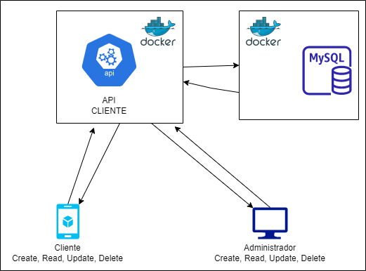

## API estruturada para dockerização e envio de imagem criada para o DockerHub

#### Tecnologias utilizadas

- Spring boot v3.0.0
- MySql v8.0.31
- Docker
- docker-compose
- DockerHub
- Swagger

API rest de cliente, contendo as principais operações CRUD. Busca paginada, busca por nome, email, cpf, id, parte de nome...

#### Estrutura do projeto

